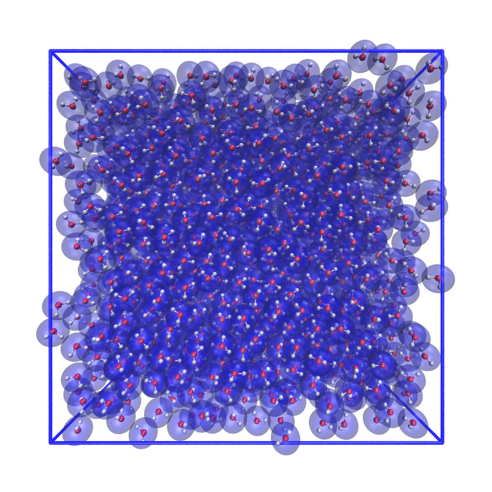
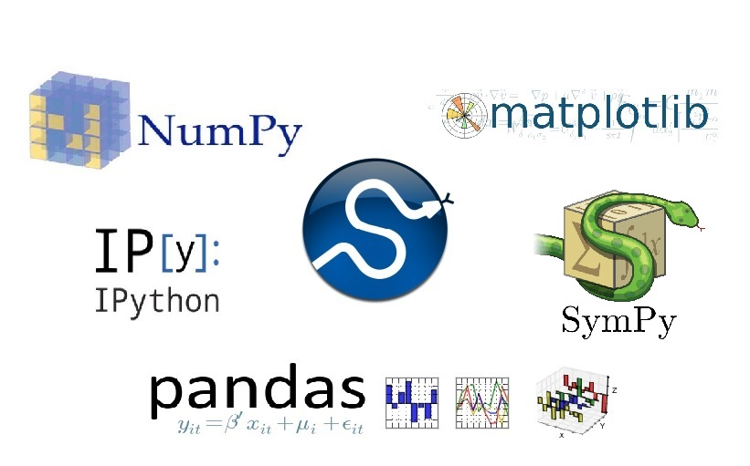
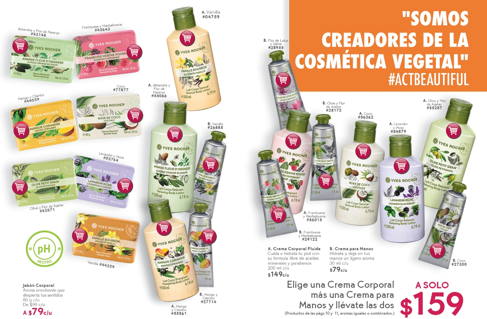
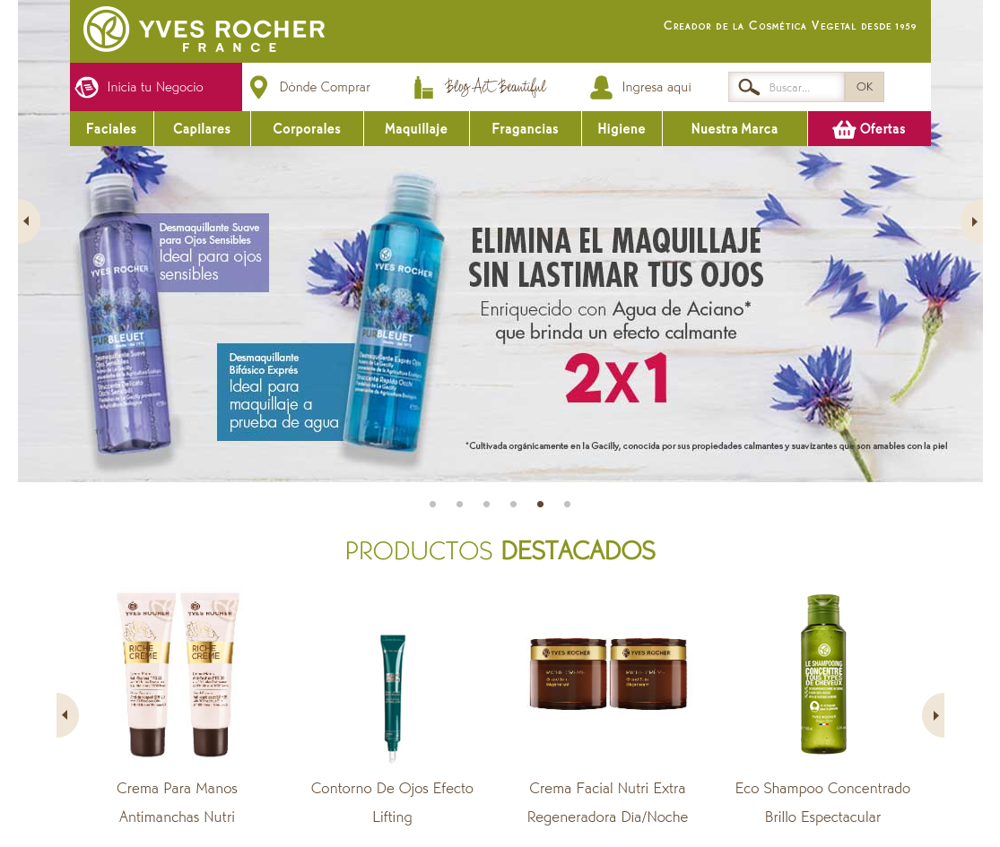
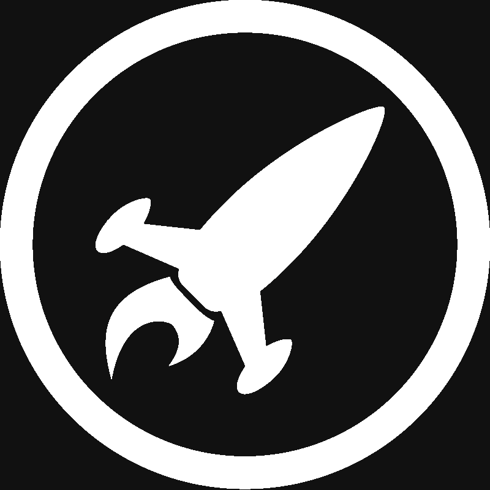
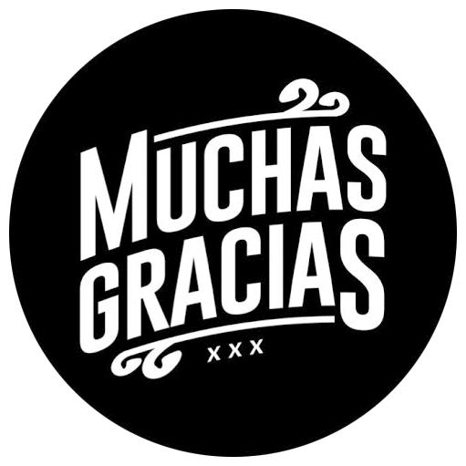

## Tonalli Rodríguez-Lopez

| Physicist, Web Dev, & Data Enthusiast
| [\@t3rodrig][] &middot; [github.com/t3rodrig][] &middot; [linkedin.com/in/t3rodrig/][]

{.cg_box}
{.cg_box}
{.cg_box}
{.cg_box}

[\@t3rodrig]: https://twitter.com/t3rodrig
[github.com/t3rodrig]: https://github.com/t3rodrig
[linkedin.com/in/t3rodrig/]: https://www.linkedin.com/in/t3rodrig/

## Project

A tool for door-to-door salesperson

{#ecommerce}

## Web Scraping

| Faciales | Capilares | Corporales | Maquillaje | Fragancias | Higiene

{#ecommerce}

## Recommender System

* Through NLP we extract the most characteristic words of all the products.
* We build a vector that collects all the words.
* We use the cosine similarity score to identify the most similar products.

## Demo

[iron-recsys.netlify.app/](https://iron-recsys.netlify.app/){#demo_link}
{#App-logo}
  
## Tonalli Rodríguez-Lopez

{.thanks}